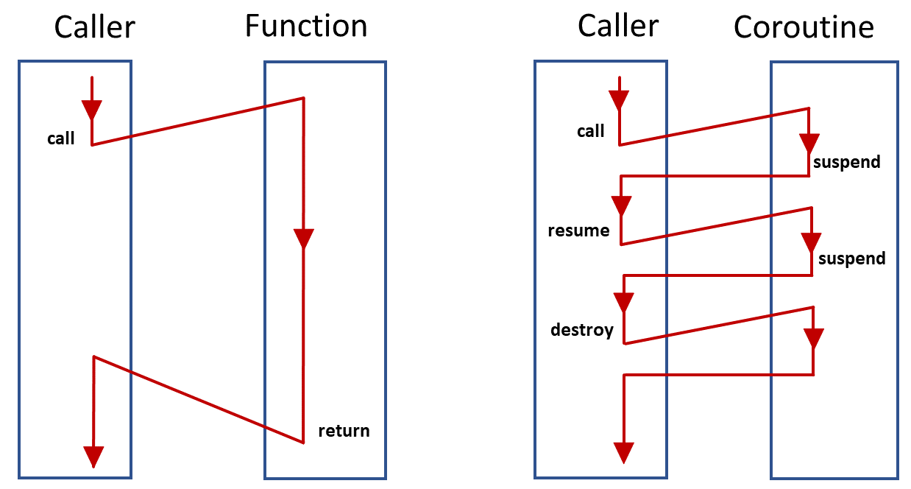
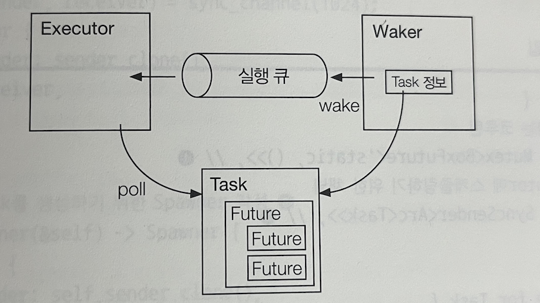

### Coroutine
- 다양한 의미를 갖지만 그 중 하나로 중단과 재개가 가능한 함수를 뜻합니다.
- 그래서 코루틴을 이용한 함수를 임의의 시점에 중단하고 중단한 위치에서 함수를 재개할 수 있게 됩니다.
```
coroutine A {
    yield to B // 2

    yield to A // 4
}

coruoutine B {
    yield to A // 3
}

yield to A // 1
```
- yield는 대표적인 코루틴 명령어로 위 코드는 A -> B -> A -> B 함수의 실행이 재개되게됩니다.
- 그림과 같이 함수와 코루틴의 차이점을 나타낼 수 있습니다.


파이썬 코드의 예시로는 이렇게 됩니다.

```py
def hello():
    print('Hello,', end='')
    yield  # 여기에서 중단, 재개 ❶
    print('World!')
    yield  # 여기까지 실행 ❷

h = hello()  # 이터레이터를 생성
h.__next__() # 1까지 실행하고 중단 # -> Hello
h.__next__() # 1에서 재개하고 2까지 실행 # -> World!

```
Rust에서는 Future trait를 사용해 coroutine을 사용하게 됩니다.

``` rust
use futures::future::{BoxFuture, FutureExt};
use futures::task::{waker_ref, ArcWake};
use std::future::Future;
use std::pin::Pin;
use std::sync::{Arc, Mutex};
use std::task::{Context, Poll};

struct Hello { // ❶
    state: StateHello,
}

// 상태 ❷
enum StateHello {
    HELLO,
    WORLD,
    END,
}

impl Hello {
    fn new() -> Self {
        Hello {
            state: StateHello::HELLO, // 초기 상태
        }
    }
}

impl Future for Hello {
    type Output = ();

    // 실행 함수 ❸
    fn poll(mut self: Pin<&mut Self>,
            _cx: &mut Context<'_>) -> Poll<()> {
        match (*self).state {
            StateHello::HELLO => {
                print!("Hello, ");
                // WORLD 상태로 전이
                (*self).state = StateHello::WORLD;
                Poll::Pending // 다시 호출 가능
            }
            StateHello::WORLD => {
                println!("World!");
                // END状態に遷移
                (*self).state = StateHello::END;
                Poll::Pending // 다시 호출 가능
            }
            StateHello::END => {
                Poll::Ready(()) // 종료
            }
        }
    }
}
```
- poll을 호출하면서 내부적인 state가 바뀌고 함수의 재개와 종료를 반복할 수 있습니다.
- 함수가 재실행가능한 경우를 구분하기 위해 `Poll::Pending`을 반환하고 있습니다.


### Coroutine Scheduling
- 이러한 비대칭 코루틴을 이용하면 중단된 함수를 프로그래머 측에서 자유롭게 재개할 수 있으며, 중단과 재개를 스케줄링해서 실행할 수 있습니다.
- 코루틴 스케줄링을 하기 위해서는 앞서 설명한 컴포넌트들의 역할을 정리해보겠습니다.
- Task: 스케줄링의 대상이 되는 계산의 실행단위인 프로세스
- Executor: 실행가능한 Task를 적당한 순서로 실행하합니다
- Waker: Task를 스케줄링할때 이용합니다
- 


``` rust
// 실행 단위 ❶
use futures::future::{BoxFuture, FutureExt};
use futures::task::{waker_ref, ArcWake};
use std::future::Future;
use std::pin::Pin;
use std::sync::mpsc::{sync_channel, Receiver, SyncSender}; // ❶
use std::sync::{Arc, Mutex};
use std::task::{Context, Poll};

struct Hello { // ❶
    state: StateHello,
}

// 상태 ❷
enum StateHello {
    HELLO,
    WORLD,
    END,
}

impl Hello {
    fn new() -> Self {
        Hello {
            state: StateHello::HELLO, // 초기 상태
        }
    }
}

impl Future for Hello {
    type Output = ();

    fn poll(mut self: Pin<&mut Self>, cx: &mut Context<'_>) -> Poll<()> {
        match (*self).state {
            StateHello::HELLO => {
                print!("Hello, ");
                (*self).state = StateHello::WORLD;
                cx.waker().wake_by_ref(); // 자신을 실행 큐에 인큐
                return Poll::Pending;
            }
            StateHello::WORLD => {
                println!("World!");
                (*self).state = StateHello::END;
                cx.waker().wake_by_ref(); // 자신을 실행 큐에 인큐
                return Poll::Pending;
            }
            StateHello::END => {
                return Poll::Ready(());
            }
        }
    }
}

struct Task {
    // 실행하는 코루틴
    future: Mutex<BoxFuture<'static, ()>>, // ❶
    // Executor에 스케줄링하기 위한 채널
    sender: SyncSender<Arc<Task>>, // ❷
}

impl ArcWake for Task {
    fn wake_by_ref(arc_self: &Arc<Self>) { // ❸
        // 자신을 스케줄링
        let self0 = arc_self.clone();
        arc_self.sender.send(self0).unwrap();
    }
}

struct Executor { // ❶
    // 실행 큐
    sender: SyncSender<Arc<Task>>,
    receiver: Receiver<Arc<Task>>,
}

impl Executor {
    fn new() -> Self {
        // 채널 생성. 큐의 사이즈는 최대 1024개
        let (sender, receiver) = sync_channel(1024);
        Executor {
            sender: sender.clone(),
            receiver,
        }
    }

    // 새롭게 Task를 생성하기 위한 Spawner를 작성 ❷
    fn get_spawner(&self) -> Spawner {
        Spawner {
            sender: self.sender.clone(),
        }
    }

    fn run(&self) { // ❸
        // 채널에서 Task를 수신하고 순서대로 실행
        while let Ok(task) = self.receiver.recv() {
            // 컨텍스트를 생성
            let mut future = task.future.lock().unwrap();
            let waker = waker_ref(&task);
            let mut ctx = Context::from_waker(&waker);
            // poll을 호출해서 실행
            let _ = future.as_mut().poll(&mut ctx);
        }
    }
}

struct Spawner { // ❶
    sender: SyncSender<Arc<Task>>,
}

impl Spawner {
    fn spawn(&self, future: impl Future<Output = ()> + 'static + Send) { // ❷
        let future = future.boxed();    // Future를 Box화
        let task = Arc::new(Task {      // Task 생성
            future: Mutex::new(future),
            sender: self.sender.clone(),
        });

        // 실행 큐에 인큐
        self.sender.send(task).unwrap();
    }
}

fn main() {
    let executor = Executor::new();
    executor.get_spawner().spawn(Hello::new());
    executor.run();
}
```
- 이 코드에서는 코루틴이 어떻게 스케줄링하는지 간단한 구조를 파악할 수 있습니다.
- 일단 먼저 Task struct에 ArcWake trait를 구현해서 그림에서 나온것과 달리 Task와 Waker를 합칩니다.
- waker를 사용해서 task 자기 자신을 다시 실행큐에 집어 넣게 됩니다. 이때 Spawner를 사용하고 이를 통해 실행큐에 인큐하게 됩니다.
- Spawner는 밭은 future impl 를 box화하고 이를 task로 만들게 됩니다.
- run을 통해 여러 코루틴 task들이 들어와도 루프를 돌면서 실행할 수 있게 됩니다.


#### 세줄 요악
- 코루틴은 함수의 재개와 실행을 할 수 있게 하는 특징이 있는 함수를 뜻합니다. 
- 코루틴 스케줄러는 이러한 코루틴들의 실행과 중단을 관리하기 위해 내부적으로 실행큐를 가지고 있고, 이 실행큐에서 task를 꺼내서 executor를 통해 실행하게 되고 task들의 상태관리(pending, end, ready)는 waker에 의해 관리되게 됩니다.
- Rust에서는 Future trait를 이용해 Task+Waker, Channel을 통해 실행큐를 구현할 수 있게 됩니다.