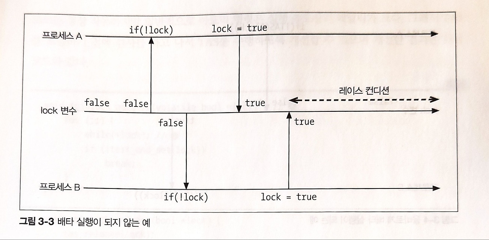
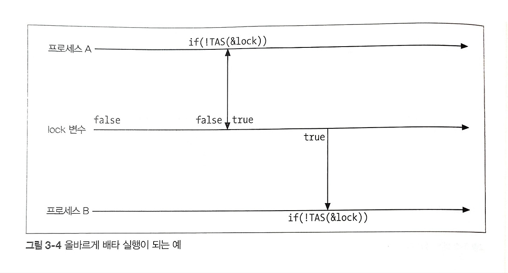

```
**Date:** 2024-12-31
```
### 3.3 Mutex
- 크리티컬 섹션을 실행할 수 있는 프로세스 수를 최대 1개로 제한하는 동기 처리입니다.
- 베타적 실행을 위해 공유변수로 사용할 플래그를 준비하고 해당 플래그가 true면 크리티컬 섹션을 실행하고 그렇지 않으면 실행하지 않는 처리라고 생각하게 됩니다.
  
- [잘못된 mutex]
```c
bool lock = false;

void some_func() {
retry:
    if (!lock) {
        lock = true; // try lock
        // critical section code - race condition을 만들 수 있는 코드
    } else {
        goto retry;
    }
    lock = false;
}
```

- 하지만 이 코드는 예상과 다르게 여러 프로세스 혹은 스레드에서 critical section을 실행할 수 있게 됩니다. 

- 그렇기 때문에 critical sectio을 실행할 권한(락을 획득,해제)을 핸들링해야 합니다.
- 이때 아래 코드처럼 TAS를 사용해 구현할 수 있습니다.
- [잘 만들어진 mutex]
```
bool lock = false;

void some_func() {
retry:
    if (!test_and_set(&lock)) { // lock, lock의 값이 false -> true로 바뀜.
        // critical section
    } else {
        goto retry;
    }
    tas_release(&lock); // unlock
}
```
- test_and_set은 lock의 값을 반환하고 lock에 true로 값을 설정하게 됩니다.
- lock이 false면 critical section이 실행되게 됩니다.
- 그리고 lock이 true면 critical section을 실행하지 못하게 됩니다. 그리고 루프를 돌면서 critical section을 실행할 수 있을때까지 반복하게 됩니다.
- 즉, 그림과 같이 프로세스 B는 lock에 접근이 불가능하기 때문에 race 컨디션이 발생하지 않게 됩니다.


#### 3.3.1 SpinLock
- 위 예제는 루프를 돌면서 락을 얻을 수 있을때까지 이를 반복하는데, 이렇게 락을 관리하는 mutex를 spinlock 방식이라고 한다.
- 하지만 이렇게 되면 lock이 false가 될때까지 계속해서 아토믹 명령어가 루프를 돌기 때문에 큰 패널티가 있는 아토믹 명령을 한번만 호출하도록 아래처럼 구현할 수 있습니다.
```c
void spinlock_acquire(volatile bool *lock) {
    for (;;) {
        while(*lock); //
        if (!test_and_set(lock))
            break;
    }
}

void spinlock_release(bool *lock) {
    tas_release(lock);
} 

bool lock = false;

void some_func() {
    for (;;) {
        spinlock_acquire(&lock); // lock 획득 
        // critical section
        spinlock_release(&lock); // lock 해제
    }
}
```
- 위 방법을 Test and Test and Set이라고 합니다.

#### 3.3.2 Pthreads의 Mutex
C언어의 Pthreads 라이브러리를 이용해 Mutex를 구현할 수 있습니다. 
```c
#include <stdio.h>
#include <stdlib.h>
#include <pthread.h>

pthread_mutex_t mut = PTHREAD_MUTEX_INITIALIZER; // mutex용 변수

void* some_func(void *args) { // 스레드용 함수 - lock/unlock 을 통해 critical section을 안전하게 다룹니다.
     if (pthread_mutex_lock(&mut) != 0) { //
        perror("pthread_mutex_lock"); exit(-1);
    }

    // 크리티컬 섹션

    if (pthread_mutex_unlock(&mut) != 0) {
        perror("pthread_mutex_unlock"); exit(-1);
    }

    return NULL;
}

int main(int argc, char *argv[]) {
    // 스레드 생성
    pthread_t th1, th2;
    if (pthread_create(&th1, NULL, some_func, NULL) != 0) {
        perror("pthread_create"); return -1;
    }

    if (pthread_create(&th2, NULL, some_func, NULL) != 0) {
        perror("pthread_create"); return -1;
    }

    // 스레드 종료 대기
    if (pthread_join(th1, NULL) != 0) {
        perror("pthread_join"); return -1;
    }

    if (pthread_join(th2, NULL) != 0) {
        perror("pthread_join"); return -1;
    }

    // mutex용 변수 메모리 해제, 메모리 누출 방지
    if (pthread_mutex_destroy(&mut) != 0) { // 4
        perror("pthread_mutex_destroy"); return -1;
    }

    return 0;
}
```
