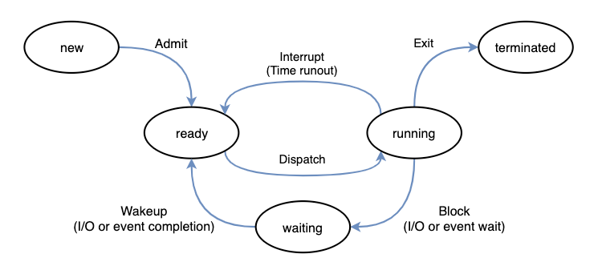

```
**Date:** 2024-12-23
```
## 동시성과 병렬성
- ref: Concurrent Programming 
### 프로세스
- 프로세스는 실햊중인 프로그램(주체)를 뜻하며 크게 다음 네가지 상태를 변경하면서 계산을 진행합니다.
- state는 크게 실행전 / 실행 / 대기 / 종료로 나뉘어집니다.
- 즉 프로세스는 항상 실행 상태가 아니라 다양한 state를 가질 수 있습니다.
- 리소스(메모리, CPU core)를 공유하는 프로세스는 번갈아가며 대기 상태에 돌입하게 됩니다.


### 동시성
- 2개 이상의 프로세스가 동시에 계산을 진행하는 상태입니다.
- `시각 t에서 여러 프로세스 p0, p1 ,p2...가 동시에 계산되고 있다`인데 그림을 기억하는게 좋습니다. 어떠한 state라도 두 개의 프로세스가 겹치는 state가 있으면 이 두 프로세스는 동시에 계산되고 있다라고 표한하게 되는거죠.

- appendix: 같은 OS 프로세스 내의 스레드 사이에서는 같은 파일 디스크립터는 같은 파일을 가르키지만 다른 OS 프로세스 사이에서는 같은 파일 디스크립터라도 다른 파일을 가르킨다.
 
### 프로세스의 병렬성
- 2개 이상의 프로세스가 동시에 `실행중인 상태`인 상태.
- `시각 t에서 여러 프로세스 p0, p1 ,p2...가 실행되고 있다`인데 이번에도 그림을 기억하는게 좋습니다. 두 개의 프로세스가 겹치는 실행중 state에 있으면 이 두 프로세스는 병렬로 계산되고 있다라고 표한하게 되는거죠.


#### task parallelism
- 태스크 병렬성은 여러 태스크(프로세스)가 동시에 실행되는 것을 의미한다.

### data parallelism
- 데이터 병렬성은 데이터를 여러 개로 나누어서 병렬로 처리하는 방법이다.
### Amdahl's Law
- 병렬화를 통한 응답 속도 향상 정도는 병렬화 가능한 처리부분, 병렬화 불가능한 처리 부분 그리고 병렬화때문에 발생하는 오버헤드로 결정된다.
  
- 그래서 오버헤드 때문에 때때로 성능이 오히려 낮게 나올 수 있습니다. 이를 정리한 암달의 법칙 공식은 다음과 같은데요.
  \[
  S = \frac{1}{(1 - P) + \frac{P}{N} + O}
  \]

  여기서,
  - \( S \)는 전체 시스템의 속도 향상 비율
  - \( P \)는 병렬화 가능한 작업의 비율
  - \( N \)는 병렬 처리에 사용되는 프로세서의 수
  - \( O \)는 병렬화로 인한 오버헤드
만약 오버헤드가 50ns(0.5), P가 0.5, N이 4일때, S는 0.899이고 결과적으로 더 느리게 실행된다는것을 알 수 있습니다. 그래서 병렬화를 한다고 무조건적으로 더 빨라지는것은 아닐 수 있습니다.

### instruction-level parallelism
- 주로 하드웨어나 컴파일러에서 수행을 도와줍니다. 제일 유명한것이 RISC-V의 pipeline 구조입니다. 
- 프로그래머가 실질적으로 행할 수 있는 방식은 memory prepetch인데, 메모리를 읽는 작업과 그 와 관련 없는 산술 연산을 수행하는 것이 그 방법입니다.

### 동시처리의 필요성과 계산 경로수 급증
- 동시 처리는 효율이 좋고 반면 복잡성이라는 문제도 안고 있는데요.
- 예를 들어 동시에 동작하지만 병렬하게 작동하지 않는 프로세스가 4개라면 실행패턴이 4!으로 24가지나 된다. 10개만 되도 그 숫자는 엄청나게 커지게 됩니다.
- 여기에 병렬성까지 고려하게 되면 엄청나게 많은 계산 경로수가 등장하게 되고 이중에서 경로를 프로그램은 선택해야하는 문제가 발생한다. 그래서 동시성 프로그래밍의 작동원리와 이론 모델을 학습하고 버그를 줄이고 편리성을 유지하고 병렬로 고속 작동하는 소프트웨어를 작성할 줄 알아야 합니다. 