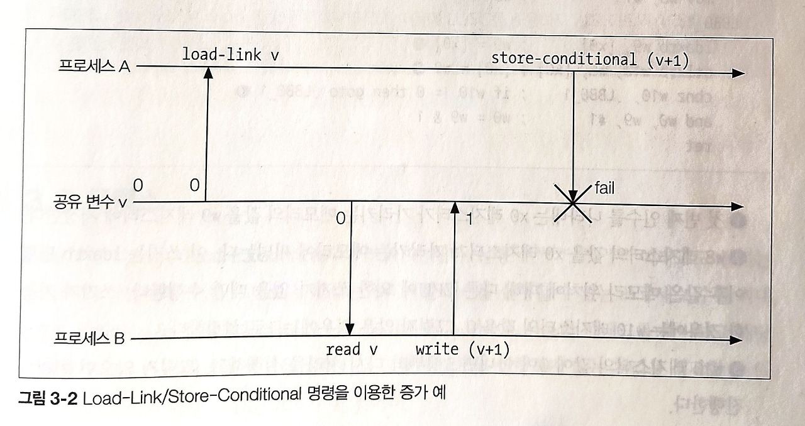

```
**Date:** 2024-12-30
```

## 동기 처리
### 3.1 Race condition
- 동시성 프로그래밍에서 예기치 못한 결함에 빠지는 상태
- 이 race condition을 일으키는 코드 부분을 critical sectio이라고 부릅니다.
- ex. 여러 프로세스가 동시에 접근하는 공유 변수에 대해 값을 읽고 쓸때, 동시에 쓰고 읽을때 발생하게 됩니다.
### 3.2 Atomic operation
- atomic operation은 이름과 다르게 단순하게 나눌 수 없는 처리를 뜻하는 것이 아니고,
- 처리의 도중 상태는 읽을 수 없으며, 만약 처리가 실패하면 처리 전 상태로 완전복원하는 operation을 뜻합니다.

#### 3.2.1 Compare and Swap
- CAS(Compare and Swap)은 semaphore, lock-free, wait-free 한 데이터 구조를 구현하기 위한 동기 처리입니다.
- C 언어에서는 __sync_bool_compare_and_swap를 통해 compare and swap을 지원하는데
```c

bool compare_and_swap(uint64_t *p, uint64_t val, uint64_t newval)
{
    if (*p != val) { // *p의 값이 val과 다르면 false를 반환한다.
        return false;
    }
    *p = newval; // *p의 값이 val과 같으면 *p에 newval을 대입하고 true를 반환한다.
    return true;
}
// __sync_bool_compare_and_swap 위 구현과 동일한 역할을 합니다.
bool compare_and_swap(unit64_t *p, uint64_t val, uint64_t newval)
{
    return __sync_bool_compare_and_swap(p, val, newval);
}
```

- 실제 이 코드가 컴파일되어 어셈블리어로 나타내면, 아래와 같이 나오게 됩니다.
- 왼쪽은 어셈블리어, 오른쪽은 이를 c언어 형식으로 표현한것입니다. 
```assembly
movq %rsi, %rax; => %rax = %rsi; 두 번째 인수를 의미하는 rsi 레지스터의 값을 rax 레지스터로 복사한다.
xorl %ecx, %ecx; => %ecx = 0; // ecx 레지스터의 값을 0으로 초기화한다.
lock cmpxchgq %rdx, (%rdi); => CAS
sete %cl => %cl = ZF flag; // sete 명령은 Set Byte on Condition 명령이라 불리는 명령의 하나이며, ZF 클래스의 값을 cl 레지스터에 저장한다.
movl %ecx, %eax; => %eax = %ecx
retq;
```
- 여기서 가장 중요한 명령어는 `lock cmpxchgq %rdx, (%rdi);` 인데 이것은 아래 코드와 같은 역할을 합니다.
- lock은 CPU가 여럿인 경우에도 하나의 명령어만 해당 메모리에 접근할 수 있음을 보장하게 됩니다.
```c
if (%rax == (%rdi)) {
    (%rdi) = %rdx
    ZF = 1
} else {
    %rax = (%rdi)
    ZF = 0
}
```
#### 3.2.2 Test and Set
- CAS와 비슷하게 TAS 아토믹 처리 방식이 있습니다.
- 이 또한 C내장 함수가 있고 아래와 같이 동작하는데요.
```c
type __sync_lock_test_and_set(type *p, type val) {
    type tmp = *p;
    *p = val;
    return tmp;
}
``` 
```assembly
movb   $1, %al      ; %al = 1
xchgb  %al, (%rdi)  ; TAS, xchgb 명령으로 al 레지스터의 값과 첫 번째 인수를 의미하는 rdi 레지스터가 가리키는 메모리의 값을 교환한다.
andb   $1, %al      ; %al = %al & 1, al 레지스터의 하위 1비트의 값이 추출된다.
retq
```
- 정리하자면 기존값을 반환하고 새로운 값을 set 하는 함수입니다.
#### 3.2.3 Load-Link/Store-Conditional
- 이번 아토믹 처리에는 CPU에서 자체적으로 지원하는 Load-Link/Store-Conditional(LL/SC) 명령을 이용해 아토믹 처리를 구현하게 됩니다.
- 앞서 언급된 `lock`이 이에 해당하는 명령어 입니다.
- LL 명령은 메모리 읽기를 수행하는 명령이지만 읽을 때 메모리를 배타적으로 읽도록 지정합니다. SC 명령은 메모리 쓰기를 수행하는 명령이며, LL 명령으로 읽은 메모리에 쓰기 작업을 하는 경우에 다른 프로세스가 이미 작업을 했으면, 쓰기(SC작업)이 실패하게 됩니다. 즉 아래 그림과 같은 경우에는 실패하게 됩니다.
- 
- Load-link/Store-Conditional 명령어로 구현된 TAS
```assembly
    mov w8, #1            ; w8 = 1
.LBBO_1: 
    ldaxrb w9, [x0]       ; w9 = [w0], 첫 번째 인수를 나타내는 x0 레지스터가 가리키는 메모리의 값을 w9 레지스터에 저장한다.
    stlxrb w10, w8, [x0]  ; [x0] = w8, w8 레지스터의 값을 x0 레지스터가 가리키는 메모리에 써 넣는다. 
    cbnz w10, .LBB0_1.    ; if w10 != 0 then goto .LBB0_1, w10 레지스터의 값이 0이 아니면 3행부터 다시 처리를 실행하고, 그렇지 않으면 처리를 진행한다.
    and w0, w9, #1        ; w0 = w9 & 1
    ret
```
- `ldaxrb`은 LL 명령어이고, `stlxrb`은 SC 명령어이고, 해당 에러가 일어나지 않고 성공적으로 수행이되면 0이 반환이 되어 그 다음 명령어를 실행하지만, 1을 반환하면 이 작업을 반복하게 됩니다. 그렇게 두 명령어 사이에 `[x0]`에 접근하는 operation이 atomic하다고 보장할 수있게 됩니다.

