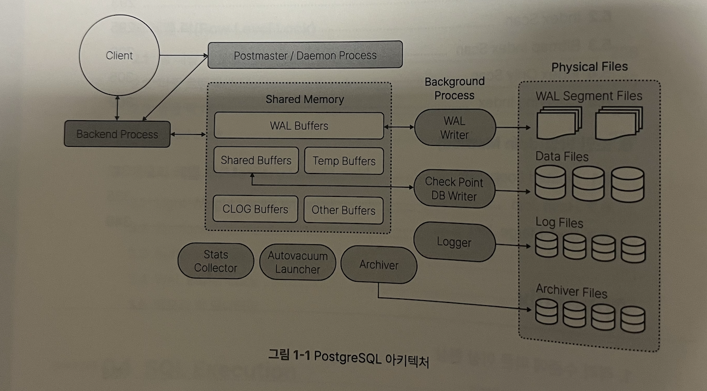
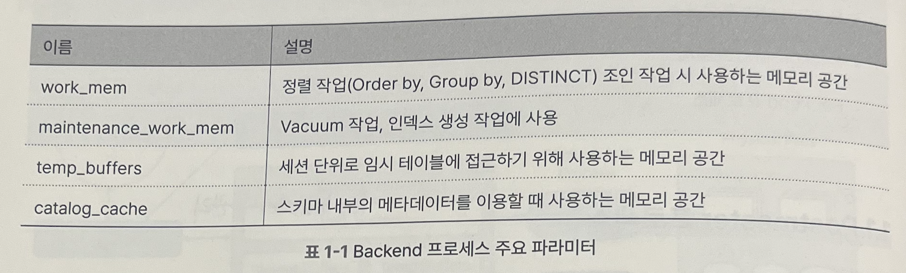
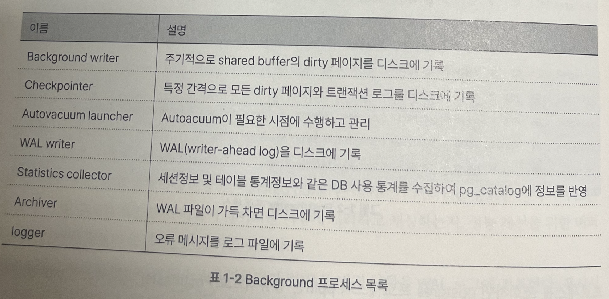
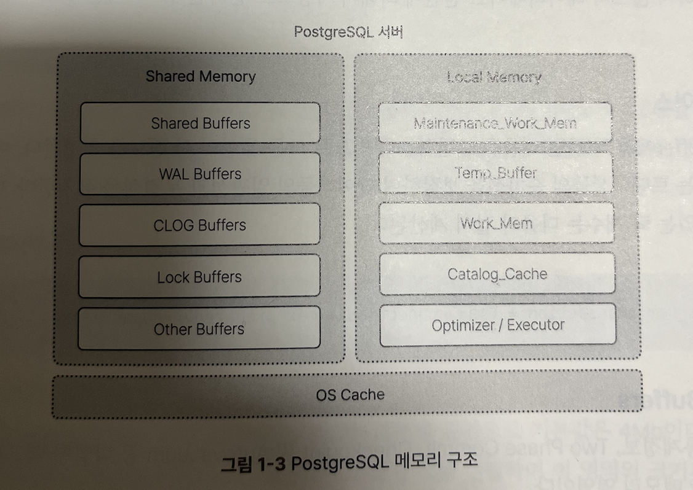

## Postgres 아키텍처
PostgreSQL은 프로세스와 시스템 운영에 필요한 파일들 그리고 메모리 영역으로 구성되어 있습니다.

주요 프로세스는 **postmaster** / **background** / **backend** 3가지로 구성되어 있습니다.
메모리의 경우 개별 프로세스를 위한 **로컬 메모리** / 모든 프로스세가 공유하는 **공유 메모리(shared buffer)** 가 있습니다.
또한 디스크에 기록되기 전 모든 변경사항을 **WAL 로그**에 기록하게됩니다. 복구와 안정성과 일관성을 가지기 위해 사용됩니다.

## Main Process
PostgreSQL은 Postmaster + Postmaster에서 포크된 N개의 프로세스로 구성되어 있습니다. 이렇게 생성된 프로세스는 서로 상호 작용을 하면서 시스템이 운용한다.

### Postmaster
Postmaster Process는 인스턴스가 기동될때 가장 먼저 시작되며 여러 Background 프로세스와 Backend 프로세스를 생성합니다.
Postmaster는 클라이언트가 접속을 시도하면 Backend가 생성됩니다.

### Backend
이렇게 Postmaster에 의해 생성된 Backend는 클라이언트가 요청한 쿼리를 수행하고 결과를 전송하게 됩니다. 이는 당연히 클라이언트와 1대1 관계를 가지게 됩니다.
여기서 backend는 로컬 메모리를 사용하는데 work_mem / maintenance_work_mem / temp_buffers / catalog_cache

### Background
PostgreSQL의 서버 운영은 이름에서 유추할 수 있듯이 Background가 유지합니다.

## PostgresSQL Memory
- 모든 프로세스들이 접근하는 Shared Memory
- Backend Process에 해당하는 Local Memory
- OS 캐시 영역

메모리의 핵심은 디스크 IO작업을 실질적으로 줄여주게 됩니다. 공유 메모리와 OS캐시를 함께 사용하여 데이터에 빠르게 접근이 가능하게 됩니다.

### Shared Memory
다음 핵심적인 4가지 영역으로 구성되어 있습니다.

- Shared Buffer
  > 데이터의 변경사항을 페이지 단위로 처리하며 물리적인 IO를 줄여 데이터에 빠르게 접근하기 위해 사용됩니다.
- WAL Buffer
  > 데이터들의 변경사항들이 임시로 저장되는 영역으로 WAL 버퍼에 저장된 내용들은 시간이 지나면 영구 저장 장소인 WAL 세그먼트 파일에 기록합니다. 또한 복구가 필요할 때 데이터를 재구성하는 영역입니다.
- Clog Buffer
  > Commit Log로 커밋상태를 기록하는 로그 파일입니다.
- Lock space
  > Shared Buffer에서 락 관련 내용을 보관하는 영역으로 모든 유형의 락 정보를 저장하게 됩니다. 이곳에서 저장된 락 정보는 트랜잭션들의 순차성을 보장하여 데이터들의 일관성과 무결성을 유지하게 됩니다.

### Local Memory
로컬 메모리는 앞서 설명했듯이 Backend가 쿼리를 수행하기 위해 사용되는 영역입니다. 이 프로세스는 사용자가 요청한 쿼리를 실행 후 결과를 전송하는 임무를 수행합니다.

다음 파라미터로 그 크기와 설정을 정할 수 있습니다
- maintenace_work_mem
  > 다양한 작업에 사용되는 메모리 공간으로 기본값은 64Mb며 work_mem의 1.5배를 권장합니다.
  > Vaccum 작업 / 인덱스 생성 / 테이블 변경 / 외래키 추가
- temp_buffers
  > Temp 테이블 사용을 위한 공간 / 세션 단위로 할당 가능합니다 / 기본값은 8Mb
- work_mem
  > 쿼리의 정렬 작업이나 해시 연산 수행시 사용되는 메모리 공간으로 기본값은 4Mb입니다. 크기가 부족하면 Temp 파일을 사용하게 됩니다.
- catalog_cache
  > 시스템의 카탈로그 메타데이터를 사용할때 필요한 공간입니다. 많은 세션들이 메타데이터를 조회한 경우 디스크 IO가 수행되어 성능 저하가 발생할 수 있습니다.
- optimzer/executor
  > 수행한 쿼리들에 대한 최적의 실행계획 수립 및 실행 시 사용되는 메모리 공간입니다.

