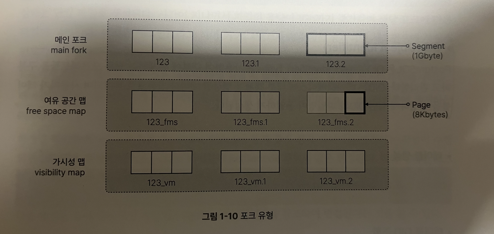

### PostgreSQL Fork

물리적으로 저장되는 파일을 포크라고 합니다. 데이터를 여러 포크로 나누어서 데이터 저장 및 검색을 최적화하게 됩니다. 



포크는 데이터 저장과 효율성을 높이기 위해 여러가지 유형으로 구분되어 딥니다. 테이블이 생성되면 해당 테이블에 대해 3개의 파일이 존재하게 됩니다.
- **Main Fork** - 주요 데이터가 저장되는 파일; 파일 이름은 테이블 OID 명으로 정해집니다.
- **Free Space Map** - 메인 포크 내의 여유공간을 관리하기 위한 파일
- **Visibility Map** - 메인 포크의 어느 페이지에 모든 활성 트랜잭션에서 볼 수 있는 튜플의 포함 여부를 기록하는 파일

### OID
PostgreSQL은 OID Types를 사용하여 내부에 존재하는 모든 오브젝트들을 구분하고 관리합니다. 테이블이 생성될때 마다 OID와 파일명이 동일한 Main Fork가 생성되게 됩니다.

``` SQL
CREATE TABLE tab_OID(id integer);

select OID, relname from pg_class where relname = 'tab_oid';

  oid   | relname 
--------+---------
 109969 | tab_oid
(1 row)

select pg_relation_filepath('tab_oid');

 pg_relation_filepath 
----------------------
 base/14088/109969 -> OID를 사용하는 것을 볼 수 있습니다.
```
### Main Fork

메인 포크는 테이블이나 인덱스의 행과 샅은 실제 데이터가 저장되는 파일 시스템을 의미합니다.
초기 상태에는 단일 파일 상태로 생성되지만 데이터가 쌓이면서 1GB를 넘으면 세그먼트를 계속해서 증가하면서 시퀀스 번호가 할당됩니다.

테이블과 인덱스를 생성하게 되면 메인 포크의 이름은 OID이게 됩니다.

### Free Space Map
데이터가 변경되면 처리되는 과정에서 데이터 페이지에 여유 공간이 생기게 됩니다. 이때 FSM은 여유 공간 정보를 저장해서 새로운 데이터가 테이블에 입력될 때 기존 데이터 페이지에 적절한 크기의 여유 공간을 찾는 역할을 합니다.

그렇게 하면
- 디스크 공간의 낭비를 줄이고 데이터 페이지 공간을 최적화 할 수 있습니다.
- 데이터 입력 시 기존 페이지의 여유 공간을 빠르게 탐색할 수 있습니다.
  

- FSM 파일은 다수의 FSM 페이지들로 구성되고 이진 트리로 구성되어 있습니다.
- 각 페이지의 리프 노드는 테이블의 페이지를 나타내거나 하위 FSM 페이지의 루트 값을 가집니다.
- 실질적으로 최하위 레벨에 해당하는 FSM 페이지가 실제 사용 가능한 공간에 대한 정보를 가지고 있습니다.

#### 동작 방식
동작방식은 3가지 상황에 나눠서 발생할 수 있습니다.
1. 페이지 할당
- 새로운 데이터가 입력되면 트리를 따라 여유공간을 가진 페이지를 서치
- 적절한 페이지가 존재하면 그 페이지에 데이터를 입력
2. 페이지 변경
- 데이터가 변경되거나 삭제되면 페이지에 여유공간이 생기게 되어 FSM 트리 해당 정보를 저장합니다.
3. Vaccum 실행
- Autovaccum 프로세스나 Vaccum 명령어를 실행해 테이블에 사용되지 않는 공간을 회수하고 FSM 정보를 변경합니다.


- 이제 Delete / Update를 수행하여 데드 튜플이 발생하면 Vaccum이 수행되고 나서 데드 튜플은 삭제되고 새롭게 생긴 Free Space는 FSM 트리 등록되고 새롭게 할당할때는 이 트리에서 크기를 가지고 서치하고 데이터를 저장할 페이지를 받게 됩니다.