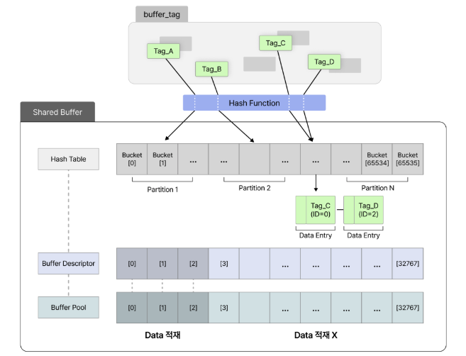
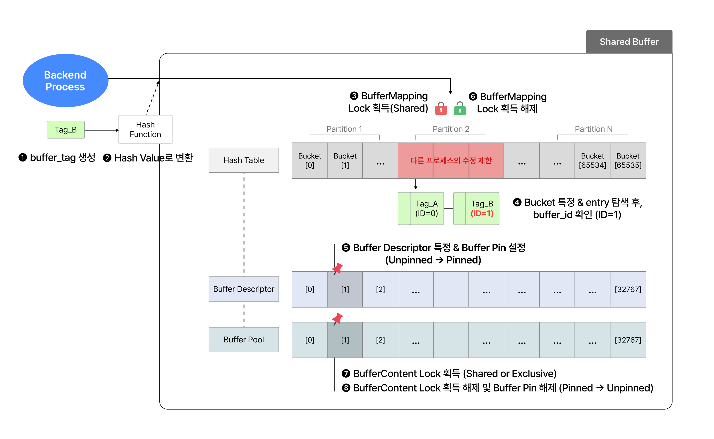
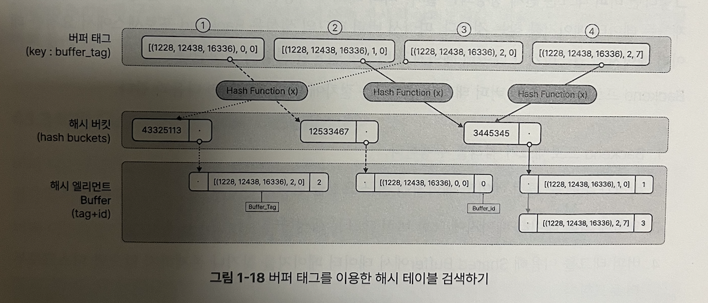
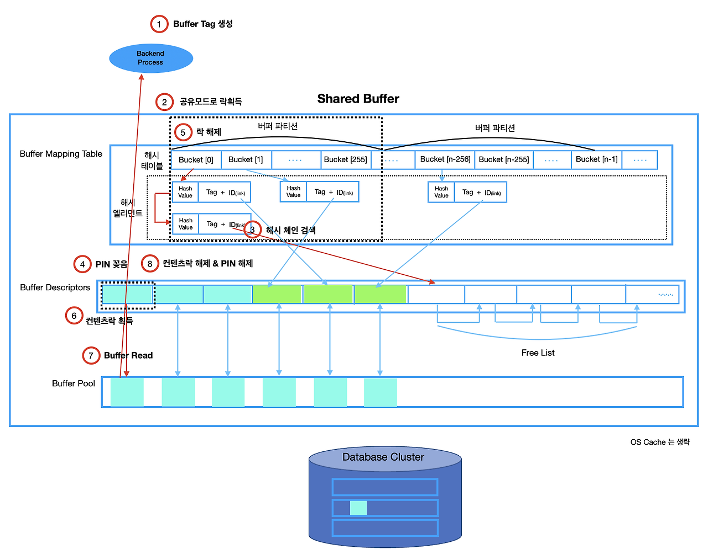

### Shared Buffer

Shared Buffer는 여러 Backend 프로세스가 동시에 사용하는 메모리로 디스크 IO를 최소화하기 위해 데이터 페이지를 메모리에 캐싱해 데이터베이스 성능을 향상 시키기위해 존재하는 메모리 영역입니다. 쿼리 실행중 디스크 IO를 일으키는 데이터를 캐싱하여 반복적인 디스크 IO를 피할 수 있습니다.

#### Shared Buffer의 구성 요소
Shared Buffer의 가장 큰 목적은 데이터에 더 빠르게 접근하는 것입니다. 원하는 데이터가 Shared Buffer에 존재하지 않으면 디스크에서 필요한 데이터를 버퍼로 읽어 처리하게 됩니다. 그러면 이후에 동일한 데이터 페이지에 대해 읽기나 쓰기에 대한 요청이 있어도 디스크 IO를 발생시키지 않고도 Shared Buffer에 데이터를 빠르게 처리할 수 있습니다.

총 4개의 구성요소로 이루어져있습니다.
- Hash Function: Backend 프로세스에서 요청한 데이터 즉 버퍼 태그는 해시 함수를 통해 해시 테이블에 빠르게 접근할 수 있게 됩니다.
- Hash Table: 앞서 사용한 Hash Function 값으로 테이블에서 원하는 페이지를 빠르게 읽습니다. 그런데 해당 페이지가 없는 경우(최초로 데이터를 가져오는 경우), 디스크로부터 데이터를 읽어 해시 테이블과 페이지를 매핑시킵니다.
- Buffer Descriptor: Buffer의 현재 상태를 추적하여 데이터 페이지가 디스크와 동기화 여부를 결정합니다.
- Buffer Pool: 데이터가 실제 저장되는 공간으로 데이터를 로드 한 후 버퍼 풀 영역에서 저장하고 관리합니다. LRU방식으로 데이터 페이지를 관리합니다.

#### Hash Table

Shared Buffer는 여러 Backend 프로세스가 동시에 접근하기 때문에 LW락을 사용하게 됩니다. 
그런데 이렇게 큰 해시 테이블을 하나의 락이 묶게 되면 비효율적이기 때문에 해시 테이블을 파티션이라는 단위로 쪼개서 여러 파티션이 각각의 락을 가지도록 사용하여 더 효율적인 형태를 가져갑니다.

버퍼 태그를 해시함수를 통해 나온 값을 통해 해시 버킷에서 값을 빠르게 가져오고 해당 버킷과 연결된 해시 엘리먼트 Buffer를 가져옵니다. 최종적으로 버퍼 아이디를 가지고 버퍼 디스크립터 그리고 버퍼풀에서 데이터를 가져올 수 있게 됩니다.

그렇다면 버퍼 태그는 언제 정의되는걸까?

버퍼 태그는 Backend 프로세스에 의해 요청한 데이터 페이지에 접근하거나 데이터 페이지가 변경이 필요한 시점에 생성되게 됩니다.
#### 정리

1. Backend 프로세스가 쿼리를 수행합니다.
2. 쿼리가 수행 중 특정 데이터 페이지에 접근 요청을 합니다.
3. 요청에 의해 데이터 페이지에 대한 버퍼 태그를 생성하게 됩니다.
4. 버퍼 태그를 이용해 버퍼 풀에서 가져오고 없으면 디스크에서 로드해옵니다.

