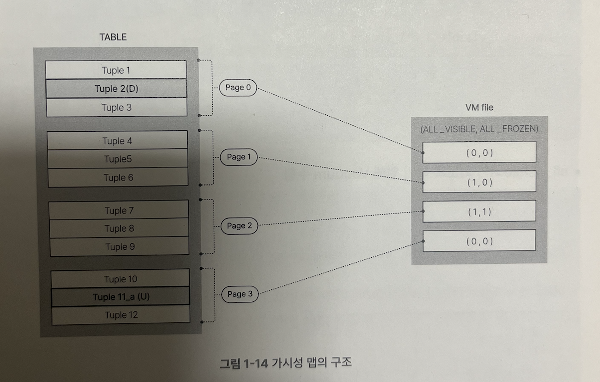

### Visibility Map
- 가시성 맵(VM)은 활성 트랜잭션들이 페이니 네의 모든 튜플의 가시성 여부를 추적하기 위해 사용됩니다. 이를 통해 Vaccum 및 인덱스 스캔을 최적화할 수 있게 됩니다.
- 다음과 같은 특징을 갖는데요.
  - 1. 테이블에는 VM 파일이 존재하지만, 인덱스에는 존재하지 않습니다.
  - 2. 데이터를 조회할 때 가장 먼저 테이블의 VM 정보를 확인합니다.
  - 3. Vaccum이 필요없는 페이지는 Skip 해서 Vaccum 작업을 최소화합니다.
#### Visibility Flags
VM은 하나의 페이지에 두개의 비트 값을 별도로 갖게 해서 visible과 frozen 상태를 미리알고 해당 페이지를 스캔하거나 Vaccum할지 결정하게 됩니다.

- **ALL_VISIBLE**
  - 비트가 1일 경우: 페이지의 모든 튜플이 모든 트랜잭션에서 가시성이 보장되며 데드 튜플이 없는 상태를 뜻함.
  - 쿼리를 할때 테이블에 있는 모든 페이지가 all_visible이 1인 경우, index only scan만으로 조회 결과를 반환할 수 있습니다.
  - 비트가 0일 경우: 페이지의 모든 튜플 또는 일부 튜플에 대해 Vaccum이 정리할 튜플이 있는 상태입니다. 즉 데드 튜플이 존재하는 상태입니다.
- **ALL_FROZEN**
  - 비트가 1일 경우: frozen 상태임을 뜻하고 말그대로 트랜잭션에 의해 데이터 변경되었던 작업이 오래동안 없었다는 것을 뜻합니다.(오래동안의 정의는 모호할 수 있지만, 명시적으로 vaccum forzen 방식으로 만들 수 있고, autovaccum 프로세스에 의해 frozen 상태가 될 수 있습니다.)
  - 비트가 0일 경우: XID는 트랜잭션간의 동시성을 처리할때 사용되는 일련번호라고 생각하시면 됩니다. 하지만 아직 frozen 상태는 아님을 뜻합니다.
이러한 Visibility Map Flags를 통해 Vaccum을 실행하거나 트랜잭션에서 해당 페이지의 스캔을 해야할지 결정하게 됩니다.(index-only scan) 해당 페이지를 스캔하면 안된다고 판단할 때 디스크에서 다시 로드해야하기 때문에 쿼리 성능을 떨어집니다. 

- [1,1]: 안전한 상태, 데이터 정합성을 유지하고있는 flag; vaccum freeze가 수행된 후의 flags
- [1,0]: frozen 상태는 아니기 때문에 지금 접근하려는 XID가 접근해도 되는지 확인하기 때문에 [1,1] 보다는 쿼리 성능을 떨어질 수 있습니다.
- [0,0]: DELETE/UPDATE에 의해 데드 튜플이 발생한 상태라 데이터 스캔을 하는 것이 유효하지 않습니다. 따라서 디스크에서 로드하고 데이터를 쿼리하게 됩니다. 
- cf. [0,1]: 에초에 불가능한 플래그
