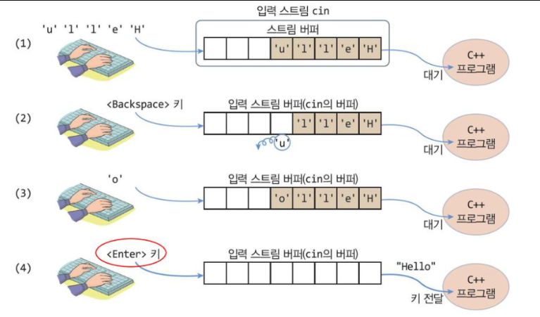
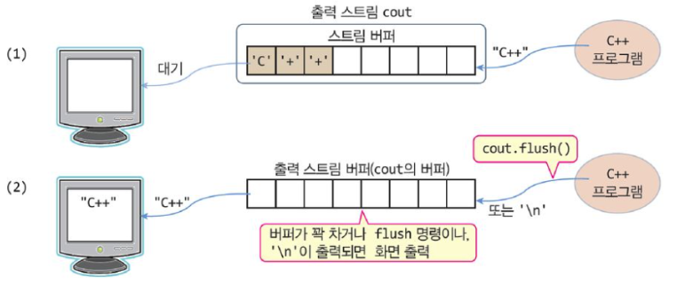

### 간단한 터미널 만들기

``` rust
use std::{ io::{ self, Write }, process::Command };

fn main() {
    loop {
        print!("Simple Shell >> ");
        io::stdout().flush().unwrap();

        let mut input = String::new();
        io::stdin().read_line(&mut input).expect("Failed to read line");
        let input = input.trim();

        if input == "exit" {
            break;
        }

        let parts: Vec<&str> = input.split_whitespace().collect();
        if parts.is_empty() {
            continue;
        }

        let cmd = parts[0];
        let args = &parts[1..];

        let output = Command::new(cmd).args(args).output().expect("Failed to execute command");

        io::stdout().write_all(&output.stdout).unwrap();
        io::stderr().write_all(&output.stderr).unwrap();
    }
}

```
io 입력/출력 스트림을 무한 반복하는 것이 셸 스크립트입니다.

### input/output stream

rust에서도 그렇고 보통 Buffered stream을 제공하게 됩니다.
아래 그림과 같이 입력 스트림 버퍼에 저장하고 이를 통해 인풋을 받고 프로그램이 받게 됩니다.


반면에 output stream은 프로그램에 의해 flush가 호출되거나 버퍼가 꽉 차면 출력 스트림 버퍼에서 io 에 출력되게 된다.



### 실제 std 상의 구현

- input stream의 readline 내부 구현

``` rust

fn read_line(&mut self, buf: &mut String) -> Result<usize> {
    unsafe { append_to_string(buf, |b| read_until(self, b'\n', b)) }
}

pub(crate) unsafe fn append_to_string<F>(buf: &mut String, f: F) -> Result<usize>
where
    F: FnOnce(&mut Vec<u8>) -> Result<usize>,
{
    let mut g = Guard { len: buf.len(), buf: unsafe { buf.as_mut_vec() } };
    let ret = f(g.buf);

    // SAFETY: the caller promises to only append data to `buf`
    let appended = unsafe { g.buf.get_unchecked(g.len..) };
    if str::from_utf8(appended).is_err() {
        ret.and_then(|_| Err(Error::INVALID_UTF8))
    } else {
        g.len = g.buf.len();
        ret
    }
}

fn read_until<R: BufRead + ?Sized>(r: &mut R, delim: u8, buf: &mut Vec<u8>) -> Result<usize> {
    let mut read = 0;
    loop {
        let (done, used) = {
            let available = match r.fill_buf() {
                Ok(n) => n,
                Err(ref e) if e.is_interrupted() => continue,
                Err(e) => return Err(e),
            };
            match memchr::memchr(delim, available) { // check available
                Some(i) => {
                    buf.extend_from_slice(&available[..=i]);
                    (true, i + 1)
                }
                None => {
                    buf.extend_from_slice(available);
                    (false, available.len())
                }
            }
        };
        r.consume(used);
        read += used;
        if done || used == 0 {
            return Ok(read);
        }
    }
}
```

### std::io를 구현하기 위해 사용되는 io 시스템 콜

``` rust
    fn fill_buf(&mut self) -> Result<&[u8]>;
```
fill_buf 함수는 내부 버퍼의 내용을 반환하며, 내부 버퍼가 비어 있는 경우 내부 리더(reader)에서 데이터를 더 가져와 채웁니다.
mut 참조값이 아니어서 실제 버퍼안에 있는 값이 변경되지는 않습니다.

``` rust
    fn consume(&mut self, amt: usize);
```
consume 함수는 지정한 길이만큼 버퍼에서 빼서 프로그램에 전달하게 됩니다.
