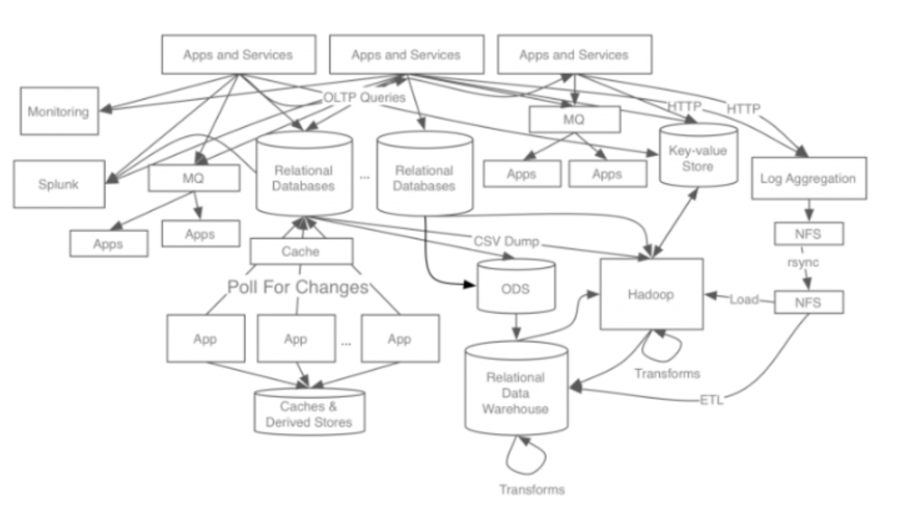
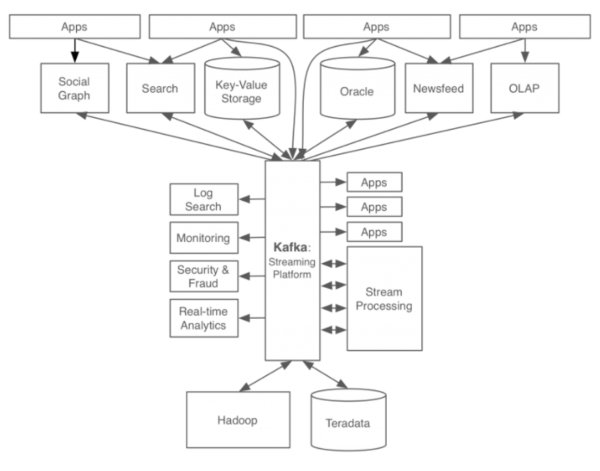
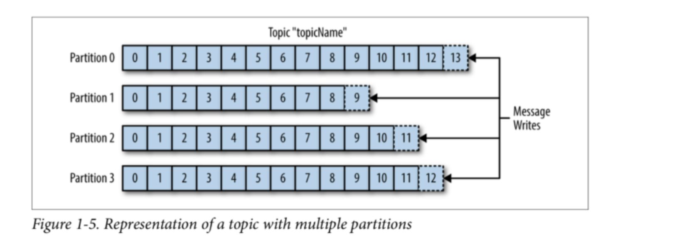

## Kafka
### Kafka?
- 아파치 카프카(Apache Kafka)는 분산형 스트리밍 플랫폼으로, 대량의 데이터를 안정적이고 실시간으로 처리할 수 있도록 설계되었습니다.
- 카프카는 주로 대량의 이벤트 스트림 데이터를 처리하고 여러 시스템 간에 데이터를 신속하게 전송하는 데 사용됩니다.
- 카프카를 쓰기전에는 서비스간에 데이터가 복잡하게 사용되다 보니 확장성과 유지보수에 어려움이 있었습니다.

- 카파카는 시스템 복잡도 증가 (Complexity) / 데이터 파이프라인 관리의 어려움을 해소하기 위해 사용되며, 보다 일관성있고 심플한 구조를 가지게 하면서도 병렬성과 확장성 그리고 신뢰성을 가져갈 수 있습니다.


### Kafka 구조
- 카프카는 pub-sub 모델의 메시지큐 형태로 동작합니다. 미들웨어 역할을 해서 producer가 만드는 메시지를 consumer에게 보내는 형태를 가지게 됩니다.
- consumer는 자기가 받을 topic을 보고 처리해야할 메시지인지 판단하게 됩니다. 이렇게 하면 토픽에 따라 consumer group(consumer 여러개의 묶음)를 추가하고 관리하니 확장성이 좋게됩니다.

- 그리고 이렇게 메시지를 만들때도 병렬처리를 위해 partition 개수를 지정할 수 있어 메시지가 병렬로 처리될 수 있어 다양한 경우에 리소스나 감당해야할 트래픽등을 생각해서 개발자에게 유연한 접근이 가능합니다.
### Kafka.js
- 사실 코드를 통해 사용하는 법은 간단합니다.
- Producer 만들어서 메시지 전송하고 카프카에서 알아서 Consumer에게 전달하니 다음과 같이 코드를 작성할수 있습니다
- Producer
```ts
const producer = new KafkaJS.Kafka({
    "client.id": "verification-api",
    "bootstrap.servers": KAFKA_BOOTSTRAP_SERVER,
    "security.protocol": "sasl_ssl",
    "sasl.mechanisms": "PLAIN",
    "sasl.username": KAFKA_API_KEY,
    "sasl.password": KAFKA_API_SECRET,
    "allow.auto.create.topics": false,
  }).producer({
    "compression.type": "lz4",
  }).connect();

await producer.send(
  this.KAFKA_TOPIC,
  messages: [
      {
        // ... 보낼 메시지들을 채워넣으면 됩니다.
      },
    ],
);
```
- Consumer
``` ts
const consumer = new KafkaJS.Kafka({
  "bootstrap.servers": KAFKA_BOOTSTRAP_SERVER,
  "security.protocol": "sasl_ssl",
  "sasl.mechanisms": "PLAIN",
  "sasl.username": KAFKA_API_KEY,
  "sasl.password": KAFKA_API_SECRET,
  "allow.auto.create.topics": false,
}).consumer({
  kafkaJS: {
    groupId: KAFKA_CONSUMER_GROUP_ID,
    fromBeginning: true,
    autoCommit: false,
  },
  "max.poll.interval.ms": MAX_TIMEOUT * 2,
});

await consumer.connect();
await consumer.subscribe({ topics: [KAFKA_TOPIC_EVM] });

```